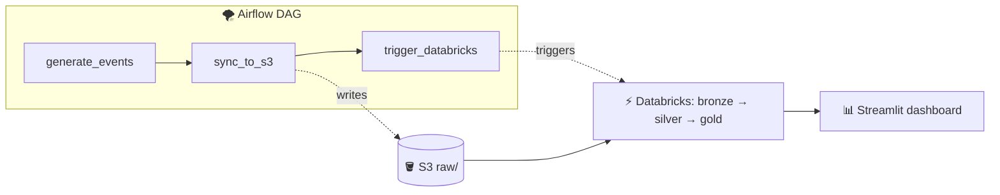

# 🍱 Food Delivery Pipeline

> End-to-end data pipeline for a simulated food delivery business — from synthetic
> event generation, through a medallion-architecture lakehouse on Databricks, to a
> dbt-modeled gold layer guarded by automated data-quality tests, ending in a live
> ops dashboard. Built as a portfolio piece drawing on my prior experience as a
> Data Analytics Engineer at foodpanda.

🔗 **Live dashboard:** [ernestau-food-delivery-ops.streamlit.app](https://ernestau-food-delivery-ops.streamlit.app)

📋 **Requirements & data model:** [`requirements-and-data-model.png`](docs/requirements-and-data-model.png)

🎥 **YouTube walkthrough:** [Food Delivery Pipeline Walkthrough](https://www.youtube.com/watch?v=vWSuyq0sTb4)

📊 **Architecture:**


---

## What it does

A Python simulator pretends to be a busy food delivery service — customers place
orders, vendors confirm, drivers pick up, deliveries complete (or cancel). Every
hour it generates a fresh batch of events with realistic volume variation (weekend
peaks, growth trend, lunch/dinner rush). Those events flow through a medallion
pipeline on Databricks — raw → cleaned → modeled — into a Kimball-style star
schema. The gold layer is modeled in dbt with a data-quality test suite and a CI
gate, and a Streamlit dashboard reads it through Databricks SQL.

Cadence: the producer runs hourly at `:05`, the Databricks pipeline at `:15` — new
events are queryable within ~15 minutes.

Layer split: bronze and silver are PySpark (Lakeflow SDP, streaming-native); gold is
dbt (SQL). Neither tool calls the other — they share Delta tables through Unity Catalog.

---

## Data Quality & Testing

The gold layer is modeled in dbt over the PySpark bronze/silver Delta tables, with
data quality enforced as executable contracts and a CI gate that blocks bad changes
from reaching `main`.

Bronze/silver cleaning is imperative work that suits PySpark; gold is declarative
aggregation that reads cleanly as SQL. Moving gold to dbt also makes tests, lineage,
and CI first-class — which turns silent data errors into loud, blocking failures.

### Tests as contracts

| Test | Where | Catches |
|---|---|---|
| `unique`, `not_null` | `event_id` (silver source) | duplicate / missing event IDs |
| `accepted_values` | `event_type` | unannounced / schema-drift event types |
| `relationships` | fact → dim FKs | orphaned references (severity: `warn`) |
| `dbt_utils.accepted_range` | `gmv >= 0` | negative revenue |
| `dbt_utils.expression_is_true` | order lifecycle | out-of-order timestamps |

Severity is tuned per test: referential-integrity checks `warn`; data-correctness
checks `error`, so they block downstream models under `dbt build` (Write-Audit-Publish).

### Fault injection

The simulator has an off-by-default `--corrupt-rate` flag that injects realistic
defects (negative GMV, orphaned FKs, duplicate/null event IDs, schema-drift event
types, inverted timestamps), so the tests can be shown going red on demand. The live
24/7 feed stays clean; CI uses a deterministic seed fixture instead of random chaos.

### CI gate

Every pull request runs [`.github/workflows/dbt_ci.yml`](.github/workflows/dbt_ci.yml):
it loads deterministic seed fixtures into an isolated schema and runs
`dbt seed → run → test` against the real Databricks engine. A failing test blocks the
merge. `main` is branch-protected to require this check.

### Bugs this caught

The suite surfaced two real, pre-existing bugs — neither planted:

- **Orphaned dimension keys** — non-deterministic (`uuid4`) dim ID generation produced
  facts referencing dimension rows that no longer existed across pipeline runs.
- **Negative GMV** — discounts applied to orders whose subtotal was smaller, driving
  GMV below zero. A negative integer is valid to Spark, so nothing upstream flagged it;
  `accepted_range` caught it immediately.

The dbt gold models, tests, and CI run side-by-side with the legacy PySpark gold.
Cutting the scheduled pipeline and dashboard fully over to dbt gold is the next step.

---

## v1: containerization & orchestration

v0 ran the producer from `cron` and let a separate Databricks scheduler fire the
transforms 10 minutes later — two orchestrators synced only by a timing buffer. v1
adds:

- **🐳 Docker** — the simulator is containerized (`Dockerfile` + `compose.yaml`): one
  command, no Python setup, reproducible build.
- **🌪️ Airflow** (local, Astro CLI) — a single DAG, `food_delivery_pipeline`, fuses the
  flow into one orchestrated unit with task dependencies and retries:



Airflow runs on demand (`schedule=None`) and coexists with the cron feed rather than
replacing it. See [`airflow/README.md`](airflow/README.md).

---

## Tech stack

| Layer | Tools |
|---|---|
| Producer | Python 3.11, [Faker](https://faker.readthedocs.io), cron, shell |
| Containerization | Docker (simulator image + `compose.yaml`) |
| Orchestration | macOS cron + Databricks scheduled job (live); Airflow (Astro CLI) on demand |
| Storage | AWS S3 (raw JSONL), Delta Lake (bronze/silver/gold) |
| Ingestion | [Auto Loader](https://docs.databricks.com/aws/en/ingestion/cloud-files/) (`cloudFiles`) |
| Transforms (bronze/silver) | [Lakeflow Spark Declarative Pipelines](https://docs.databricks.com/aws/en/ldp/) (PySpark) |
| Transforms (gold) | dbt (SQL models) + [dbt_utils](https://github.com/dbt-labs/dbt-utils), dbt-databricks adapter |
| Data quality / CI | dbt tests (generic + singular), GitHub Actions, branch protection |
| Governance | Unity Catalog (`bronze`, `silver`, `gold` / `gold_dbt`) |
| Dashboard | Streamlit, [databricks-sql-connector](https://github.com/databricks/databricks-sql-python), Plotly |

---

## Data model

Kimball star schema. Gold is modeled in dbt (SQL); bronze/silver remain PySpark.

**Facts** (different grains)
- `fct_orders` — one row per order; lifecycle timestamps, measures, FKs, derived `final_status`.
- `fct_order_items` — one row per `(order, menu_item)`; explodes the `items` array.
- `fct_order_events` — one row per state transition; the slim event log.

**Dimensions** (Type 1) — `dim_customer`, `dim_vendor`, `dim_driver`, `dim_menu_item`

**Mart** — `fct_daily_metrics` — pre-aggregated daily KPIs; powers the dashboard.

---

## Design decisions worth highlighting

| Decision | Picked | Why |
|---|---|---|
| **Gold transform engine** | dbt (SQL), not more PySpark | Gold is declarative aggregation; dbt unlocks tests, lineage, and CI as first-class. |
| **CI engine** | Real Databricks + seed fixtures, not DuckDB | Models use Spark-specific SQL (`LATERAL VIEW explode`, struct access); determinism comes from fixtures, not the engine. |
| **Test severity** | `warn` for FK integrity, `error` for correctness | Known/tolerable issues surface without blocking; must-never-happen issues quarantine downstream. |
| **Ingestion** | Batch (Auto Loader), not Kafka | Hourly cadence suits an ops dashboard; Kafka would be over-engineering. |
| **Dim semantics** | Type 1, not SCD2 | Simulator doesn't mutate dims yet, so SCD2 would add complexity with zero historical rows. |

---

## Running locally

### Simulator (Docker)
```bash
git clone https://github.com/ErnestAu/food-delivery-pipeline.git
cd food-delivery-pipeline
docker compose run --rm sim --live
docker compose run --rm sim --date 2024-01-15 --num-orders 300
# fault injection (off by default):
docker compose run --rm sim --date 2024-01-15 --num-orders 300 --corrupt-rate 0.2
```

### dbt (gold models + tests)
```bash
cd dbt/food_delivery
set -a && source ../../.env && set +a     # supply Databricks creds via env vars
dbt deps
dbt build                                  # run models + tests in DAG order
dbt docs generate && dbt docs serve        # browse the lineage graph
```

### Airflow (local orchestration)
```bash
cd airflow && astro dev start              # UI at http://localhost:8080
```

A sample of generated data is committed under [`data/samples/`](data/samples/).

---

## Project layout

```
food-delivery-pipeline/
├── simulator/                          # Python event generator
│   ├── corrupt.py                      # off-by-default fault injection (--corrupt-rate)
│   └── ...                             # config, models, lifecycle, dims, writer, main
├── dbt/food_delivery/                  # dbt project (gold layer)
│   ├── models/dims/ , models/facts/    # SQL models + schema.yml tests/descriptions
│   ├── models/sources.yml              # bronze/silver declared as dbt sources
│   ├── seeds/                          # deterministic CI fixtures
│   ├── ci/bad_fixture/                 # known-bad fixture for local demos
│   ├── profiles.yml                    # dev + ci targets (env_var-based)
│   └── packages.yml                    # dbt_utils
├── .github/workflows/dbt_ci.yml        # CI gate: seed → run → test on every PR
├── databricks/food-delivery-etl/transformations/   # PySpark bronze/silver (+ legacy gold)
├── airflow/                            # Astro CLI project — orchestration DAG
├── scripts/live_tick.sh               # hourly cron driver (simulator + S3 sync)
├── dashboard/app.py                   # Streamlit ops dashboard
└── docs/ , data/samples/
```

---

## Roadmap

**Done — containerization & orchestration:** Docker, Airflow DAG, Streamlit keep-alive
(GitHub Actions + Playwright headless session — a plain HTTP uptime ping couldn't wake Streamlit).

**Done — data quality & testing:** gold ported to dbt SQL models, dbt test suite
(generic + dbt_utils + singular), simulator `--corrupt-rate` fault injection, GitHub
Actions CI gate with seed fixtures + branch protection.

**Next — production cut-over:** run `dbt build` in the scheduled pipeline after silver;
retire the PySpark gold; point the dashboard at the dbt gold; fix the two bugs the
tests surfaced (deterministic dim IDs, discount cap).

**Later — infrastructure & a realistic source:**
- **Terraform** — S3, IAM, Databricks resources as code.
- **Postgres OLTP source** — land orders transactionally, then batch-extract (more realistic than writing JSONL directly).
- **GitHub Actions hourly producer** — move the job off laptop cron into the cloud with failure alerting.
- **SCD2 dims**, **Databricks Asset Bundles**, **Kafka ingestion** for real-time.
