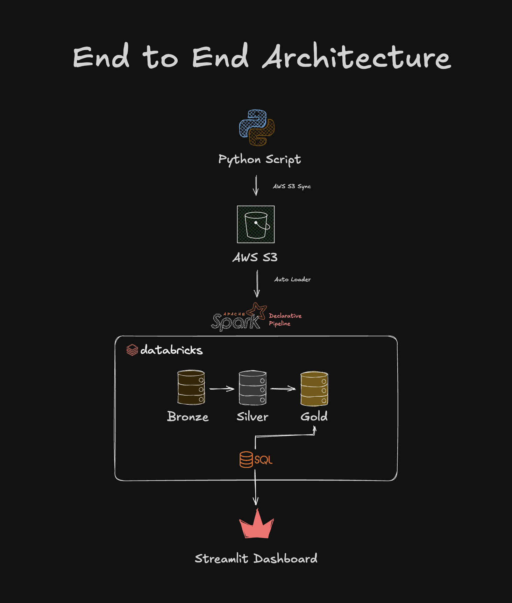
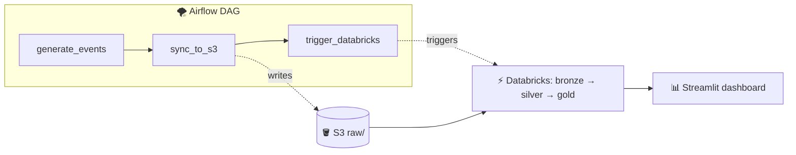

# 🍱 Food Delivery Pipeline

> End-to-end data pipeline for a simulated food delivery business — from synthetic
> event generation, through a medallion-architecture lakehouse on Databricks, to a
> dbt-modeled gold layer guarded by automated data-quality tests and CI, with a
> two-page live dashboard: business KPIs plus a pipeline-health observability view.
> Built as a portfolio piece drawing on my prior experience as a Data Analytics
> Engineer at foodpanda.

🔗 **Live dashboard:** [ernestau-food-delivery-ops.streamlit.app](https://ernestau-food-delivery-ops.streamlit.app)

📋 **Requirements & data model:** [`requirements-and-data-model.png`](docs/requirements-and-data-model.png)

🎥 **YouTube walkthrough:** [Food Delivery Pipeline Walkthrough](https://www.youtube.com/watch?v=vWSuyq0sTb4)

📊 **Architecture:**



---

## What it does

A Python simulator pretends to be a busy food delivery service — customers place
orders, vendors confirm, drivers pick up, deliveries complete (or cancel). Every
hour it generates a fresh batch of events with realistic volume variation (weekend
peaks, growth trend, lunch/dinner rush). Those events flow through a medallion
pipeline on Databricks — **raw → cleaned → modeled** — into a Kimball-style star
schema.

The **gold layer is modeled in dbt** and runs as a task inside the scheduled
Databricks job itself: every hourly run executes the SDP (bronze/silver) pipeline,
then `dbt run` + `dbt test` immediately after. The live Streamlit dashboard reads
the dbt-built gold directly.

**Cadence:** producer runs hourly at `:05`, the Databricks job at `:15` — new events
are queryable within ~15 minutes.

**Layer ownership:** bronze + silver are PySpark (Lakeflow SDP, streaming-native);
**gold is dbt (SQL)**. Unity Catalog is the shared seam — neither tool calls the
other; they agree on Delta table names.

---

## 🧪 Data Quality & Testing

The gold layer is modeled in **dbt** over the PySpark bronze/silver Delta tables,
with data quality enforced as **executable contracts** and a **CI gate** that
blocks bad changes from reaching `main`.

**Why dbt over the gold layer?** Bronze/silver cleaning is imperative work that
suits PySpark; gold is declarative aggregation/joins that read cleanly as SQL. More
importantly, dbt makes tests, lineage, and CI first-class — turning silent data
errors *loud*.

### Tests as contracts

| Test | Where | Catches |
|---|---|---|
| `unique`, `not_null` | `event_id` (silver source) | duplicate / missing event IDs |
| `accepted_values` | `event_type` | unannounced / schema-drift event types |
| `relationships` | fact → dim FKs | orphaned references |
| `dbt_utils.accepted_range` | `gmv >= 0` | negative revenue |
| `dbt_utils.expression_is_true` | order lifecycle | out-of-order timestamps |

Severity is **target-aware**: `error` in CI (a failing test blocks the merge) and
`warn` in production (known issues surface in run logs and on the health dashboard
without breaking the hourly build). Under `dbt build`, `error`-severity failures
also skip downstream models — Write-Audit-Publish fault isolation.

### Proving the tests work — fault injection

The simulator has an **off-by-default `--corrupt-rate`** flag that injects realistic
defects (negative GMV, orphaned FKs, duplicate/null event IDs, schema-drift event
types, inverted timestamps), so the tests can be shown going red on demand. The real
24/7 feed stays clean; CI uses a deterministic seed fixture instead of random chaos.

### CI gate

Every pull request runs [`.github/workflows/dbt_ci.yml`](.github/workflows/dbt_ci.yml):
it loads deterministic **seed fixtures** into an isolated schema and runs
`dbt seed → run → test` against the real Databricks engine. A failing test blocks the
merge. `main` is branch-protected to require this check (admins included).

### Bugs this actually caught

The suite surfaced **two real, pre-existing bugs** — neither planted:
- **Orphaned dimension keys** — non-deterministic (`uuid4`) dim ID generation produced
  facts referencing dimension rows that no longer existed across pipeline runs.
- **Negative GMV** — discounts (¥500) applied to orders whose subtotal was smaller,
  driving GMV below zero. Invisible to Spark (a negative int is valid); caught instantly
  by `accepted_range`.

A related idempotency bug was found and **fixed**: event/order IDs were generated with
raw `uuid4`, so re-running a backfill produced structurally-duplicate events with fresh
IDs that dedup could never catch. IDs are now derived from the per-hour seeded RNG —
re-running the same hour reproduces identical events, and silver's
`dropDuplicates(event_id)` collapses true replays to zero net rows.

---

## 🩺 Observability

Two layers, deliberately different:

- **Alert on the unexpected** — a Databricks **SQL Alert** fires if the newest event
  is more than 3 hours old (a stalled pipeline fails no tests — liveness needs its
  own check), and the Databricks job sends **failure-notification emails**.
- **Dashboard the known** — the public **Pipeline Health** page tracks freshness per
  layer (plus last pipeline run from Delta commit history), orders-per-hour against a
  trailing 7-day same-hour baseline (with a selectable window), counts of known
  data-quality issues, and a bronze → silver → gold row-count funnel. Known issues are
  tracked there rather than alerted — paging on a known, unfixed issue is just noise.

---

## v1: containerization & orchestration

v0 ran the producer from `cron` and let a separate Databricks scheduler fire the
transforms 10 minutes later — two orchestrators synced only by a timing buffer. v1
adds:

- **🐳 Docker** — the simulator is containerized (`Dockerfile` + `compose.yaml`): one
  command, no Python setup, reproducible build.
- **🌪️ Airflow** (local, Astro CLI) — a single DAG, `food_delivery_pipeline`, fuses the
  flow into one orchestrated unit with task dependencies and retries:



Airflow runs on demand (`schedule=None`) and coexists with the cron feed rather than
replacing it. See [`airflow/README.md`](airflow/README.md).

---

## Tech stack

| Layer | Tools |
|---|---|
| Producer | Python 3.11, [Faker](https://faker.readthedocs.io), cron, shell |
| Containerization | Docker (simulator image + `compose.yaml`) |
| Orchestration | macOS cron (producer) + a scheduled Databricks job running SDP **then a dbt task**; Airflow (Astro CLI) on demand |
| Storage | AWS S3 (raw JSONL), Delta Lake (bronze/silver/gold) |
| Ingestion | [Auto Loader](https://docs.databricks.com/aws/en/ingestion/cloud-files/) (`cloudFiles`) |
| Transforms (bronze/silver) | [Lakeflow Spark Declarative Pipelines](https://docs.databricks.com/aws/en/ldp/) (PySpark) |
| **Transforms (gold)** | **dbt (SQL models) + [dbt_utils](https://github.com/dbt-labs/dbt-utils), dbt-databricks adapter — run as a Databricks job task** |
| **Data quality / CI** | **dbt tests (generic + package), GitHub Actions, branch protection** |
| **Observability** | **Databricks SQL Alerts, job failure notifications, public Pipeline Health page** |
| Governance | Unity Catalog (`bronze`, `silver`, `gold`, `gold_dbt`) |
| Dashboard | Streamlit (multipage), [databricks-sql-connector](https://github.com/databricks/databricks-sql-python), Plotly |

---

## Data model

Kimball star schema. **Gold modeled in dbt (SQL);** bronze/silver remain PySpark.

**Facts** (different grains)
- `fct_orders` — one row per order; lifecycle timestamps, measures, FKs, derived `final_status`.
- `fct_order_items` — one row per `(order, menu_item)`; explodes the `items` array.
- `fct_order_events` — one row per state transition; the slim event log.

**Dimensions** (Type 1) — `dim_customer`, `dim_vendor`, `dim_driver`, `dim_menu_item`

**Mart** — `fct_daily_metrics` — pre-aggregated daily KPIs; powers the dashboard.

---

## Design decisions worth highlighting

| Decision | Picked | Why |
|---|---|---|
| **Gold transform engine** | dbt (SQL), not more PySpark | Gold is declarative aggregation; dbt unlocks tests, lineage, and CI as first-class. |
| **Where dbt runs in prod** | A dbt task inside the existing Databricks job, after SDP | Gold refreshes the moment silver lands — one job, one dependency chain, no second scheduler. |
| **CI engine** | Real Databricks + seed fixtures, not DuckDB | Models use Spark-specific SQL (`LATERAL VIEW explode`, struct access); determinism comes from fixtures, not the engine. |
| **Test severity** | `error` in CI, `warn` in production | The gate keeps its teeth on PRs; known real-data issues surface without breaking the hourly build. |
| **Cutover strategy** | Repoint the dashboard to `gold_dbt`; keep PySpark gold running as a live fallback | Zero-downtime, instantly reversible; the legacy gold is retired only after the dbt gold proves itself in production. |
| **Alerting philosophy** | Alert on freshness/volume anomalies; dashboard the known issues | Paging on known, unfixed data debt trains you to ignore alerts. |
| **Ingestion** | Batch (Auto Loader), not Kafka | Hourly cadence suits an ops dashboard; Kafka would be over-engineering. |
| **Dim semantics** | Type 1, not SCD2 | Simulator doesn't mutate dims yet, so SCD2 would add complexity with zero historical rows. |

---

## Running locally

### Simulator (Docker)
```bash
git clone https://github.com/ErnestAu/food-delivery-pipeline.git
cd food-delivery-pipeline
docker compose run --rm sim --live
docker compose run --rm sim --date 2024-01-15 --num-orders 300
# fault injection (off by default):
docker compose run --rm sim --date 2024-01-15 --num-orders 300 --corrupt-rate 0.2
```

### dbt (gold models + tests)
```bash
cd dbt/food_delivery
set -a && source ../../.env && set +a     # supply Databricks creds via env vars
dbt deps
dbt build                                  # run models + tests in DAG order
dbt docs generate && dbt docs serve        # browse the lineage graph
```

### Dashboard (both pages)
```bash
streamlit run dashboard/app.py             # Pipeline Health + Food Delivery Ops
```

### Airflow (local orchestration)
```bash
cd airflow && astro dev start              # UI at http://localhost:8080
```

A sample of generated data is committed under [`data/samples/`](data/samples/).

---

## Project layout

```
food-delivery-pipeline/
├── simulator/                          # Python event generator
│   ├── corrupt.py                      # off-by-default fault injection (--corrupt-rate)
│   └── ...                             # config, models, lifecycle, dims, writer, main
├── dbt/food_delivery/                  # dbt project (gold layer)
│   ├── models/dims/ , models/facts/    # SQL models + schema.yml tests/descriptions
│   ├── models/sources.yml              # bronze/silver declared as dbt sources
│   ├── seeds/                          # deterministic CI fixtures
│   ├── ci/bad_fixture/                 # known-bad fixture for local demos
│   ├── profiles.yml                    # dev + ci targets (env_var-based)
│   └── packages.yml                    # dbt_utils
├── .github/workflows/dbt_ci.yml        # CI gate: seed → run → test on every PR
├── databricks/food-delivery-etl/transformations/   # PySpark bronze/silver (+ legacy gold)
├── airflow/                            # Astro CLI project — orchestration DAG
├── scripts/live_tick.sh               # hourly cron driver (simulator + S3 sync)
├── dashboard/                          # Streamlit multipage app
│   ├── app.py                          # entrypoint / page router
│   ├── db.py                           # shared Databricks SQL connection
│   ├── pipeline_health.py              # observability page (default landing)
│   └── food_delivery_ops.py            # business KPI page
└── docs/ , data/samples/
```

---

## Roadmap

**✅ v1 — containerization & orchestration:** Docker, Airflow DAG, Streamlit keep-alive
(GitHub Actions + Playwright headless session — a plain HTTP uptime ping couldn't wake Streamlit).

**✅ v2 — data quality, testing & observability:** gold ported to dbt and running inside
the scheduled Databricks job; dbt test suite (generic + dbt_utils) with target-aware
severity; simulator `--corrupt-rate` fault injection; GitHub Actions CI gate with seed
fixtures + branch protection; dashboard cut over to the dbt-built gold; freshness
alerting + a public Pipeline Health observability page; deterministic event/order IDs
for idempotent reprocessing.

**🔜 v2 wrap-up:** retire the legacy PySpark gold once the dbt gold has served the
dashboard reliably; fix the two known data bugs (deterministic dim IDs, discount cap).

**📌 v3 — infra & realistic source:**
- **Terraform** — S3, IAM, Databricks resources as code.
- **Postgres OLTP source + CDC** — land orders transactionally, then extract incrementally (a more realistic source than writing JSONL directly).
- **Cloud-scheduled producer** — move the hourly job off laptop cron (GitHub Actions cron) with failure alerting.
- **SCD2 dims**, **Databricks Asset Bundles**, **Kafka ingestion** for real-time.
