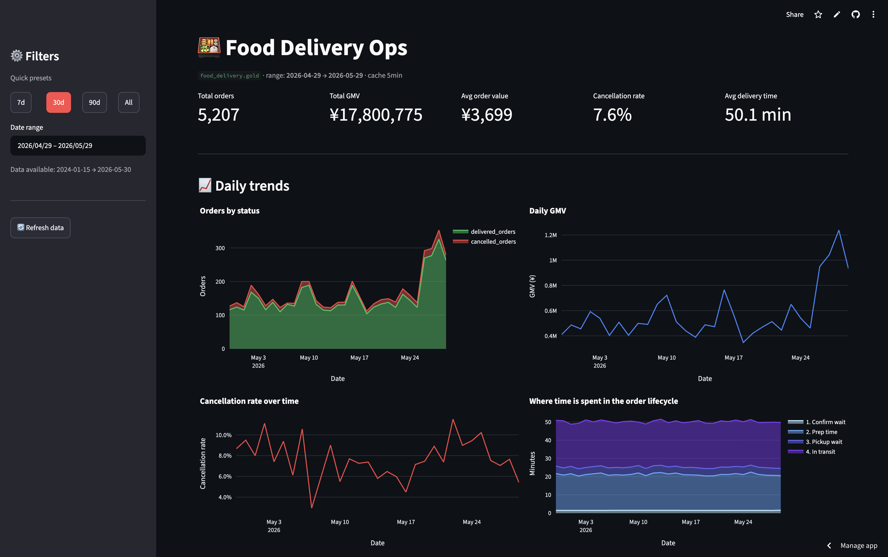
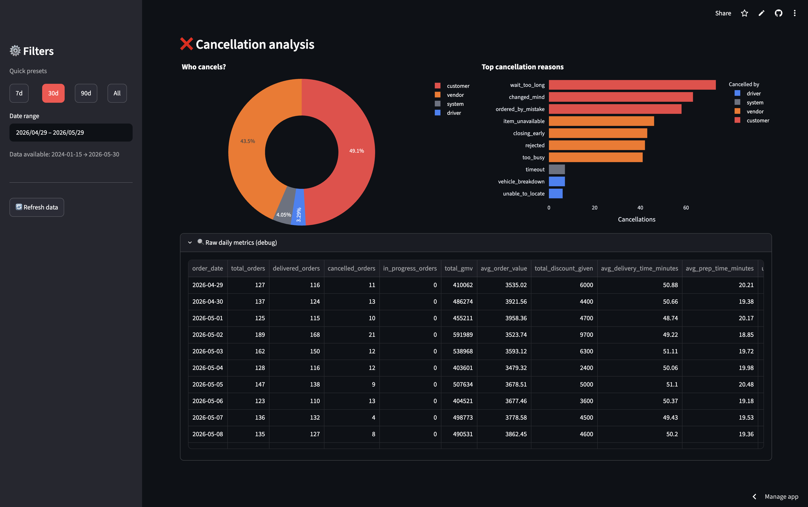
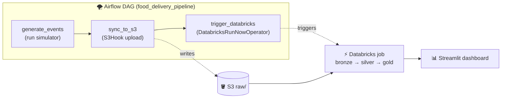

# 🍱 Food Delivery Pipeline

> End-to-end batch data pipeline for a simulated food delivery business —
> from synthetic event generation, through medallion-architecture transformations on Databricks,
> to a live ops dashboard. Built as a portfolio piece drawing on my prior experience as a
> Data Analytics Engineer at foodpanda.

🔗 **Live dashboard:** [ernestau-food-delivery-ops.streamlit.app](https://ernestau-food-delivery-ops.streamlit.app) 

📋 **Requirements & data model:** [`requirements-and-data-model.png`](docs/requirements-and-data-model.png)

🎥 **YouTube video walkthrough:** [Food Delivery Pipeline Walkthrough](https://www.youtube.com/watch?v=vWSuyq0sTb4)

📊 **Architecture:**


📸 **Dashboard preview:**




---

## What it does

A Python simulator pretends to be a busy food delivery service — customers place orders, vendors confirm them, drivers pick them up, deliveries complete (or get cancelled). Every hour, the simulator generates a fresh batch of events with realistic volume variation (weekend peaks, growth trend, lunch/dinner rush). Those events flow through a medallion-architecture pipeline on Databricks — raw → cleaned → modeled — and land in a Kimball-style star schema. A Streamlit dashboard queries the gold layer through Databricks SQL Warehouse, giving a live operations view.

Pipeline cadence: producer runs hourly at `:05`, Databricks pipeline runs at `:15`. New events are queryable in the dashboard within ~15 minutes of being generated.

---

## v1: containerization & orchestration

v0 ran the producer from a macOS `cron` job and let a separate Databricks scheduler fire the transformations 10 minutes later — two orchestrators with no awareness of each other, synced by a timing buffer between the 2 scheduled jobs. v1 adds two things on top of that working baseline:

- **🐳 Docker** — the simulator is containerized (`Dockerfile` + `compose.yaml`), so it runs identically anywhere with one command, no Python/venv setup. Reproducible build, single-purpose image.
- **🌪️ Airflow** (local, via the Astro CLI) — a single DAG, `food_delivery_pipeline`, fuses the whole flow into one orchestrated unit with real task dependencies, automatic retries (2 attempts, 2-minute back-off), and a visual run history:



Airflow runs on-demand (manual trigger, `schedule=None`) and coexists with the still-running cron feed rather than replacing it — local Airflow isn't meant to be a 24/7 driver. It's a complete, working orchestration of the full pipeline that you trigger on demand; cron stays the lightweight always-on producer. See [`airflow/README.md`](airflow/README.md) for the DAG details and how to run it.

---

## Tech stack

| Layer | Tools |
|---|---|
| Producer | Python 3.11, [Faker](https://faker.readthedocs.io), cron, shell |
| Containerization | Docker (simulator image + `compose.yaml`) |
| Orchestration | **Live (production):** macOS cron (producer) + Databricks scheduled job (transforms). **Airflow ([Astro CLI](https://www.astronomer.io/docs/astro/cli/overview)):** a single DAG that unifies the full flow, run on demand — the v1 alternative to the two separate schedulers. |
| Storage | AWS S3 (raw JSONL), Delta Lake (bronze/silver/gold) |
| Ingestion | [Auto Loader](https://docs.databricks.com/aws/en/ingestion/cloud-files/) (`cloudFiles`) |
| Transformations | [Lakeflow Spark Declarative Pipelines](https://docs.databricks.com/aws/en/ldp/) (Python decorators: `@dp.table`, `@dp.materialized_view`) |
| Governance | Unity Catalog (3 schemas: `bronze`, `silver`, `gold`) |
| Dashboard | Streamlit, [databricks-sql-connector](https://github.com/databricks/databricks-sql-python), Plotly |

---

## Data model

Kimball star schema in `food_delivery.gold`:

**Facts** (different grains)
- `fct_orders` — one row per order. Lifecycle timestamps denormalized as columns (`placed_at`, `confirmed_at`, ..., `delivered_at`, `cancelled_at`), measures (`gmv`, `food_cost`, `delivery_fee`, `service_fee`, `discount`), FKs, and `final_status` derived from which timestamps are filled.
- `fct_order_items` — one row per `(order, menu_item)`. Built by exploding the `items` array from the `order_placed` event.
- `fct_order_events` — one row per state transition. The slim event log; append-only source of truth for the order lifecycle.

**Dimensions** (Type 1 in v0)
- `dim_customer`, `dim_vendor`, `dim_driver`, `dim_menu_item`

**Marts**
- `fct_daily_metrics` — pre-aggregated daily KPIs (total GMV, cancellation rate, avg delivery time, etc.). Powers the dashboard.

---

## Design decisions worth highlighting

A few choices and the reasoning, since "why" is usually more interesting than "what":

| Decision | Considered | Picked | Why |
|---|---|---|---|
| **Ingestion model** | Streaming via Kafka | Batch via Auto Loader | Hourly cadence is enough for an ops dashboard — Kafka's second-level latency would be over-engineering. v1 upgrade if real-time were ever needed. |
| **Payload representation in bronze** | Raw JSON string parsed in silver | Merged struct (Auto Loader's default) | Parquet shreds nested struct fields into separate physical columns, so queries on `payload.gmv` are as fast as flat columns. Bronze stays interpretable. Would flip to raw string only for bytes-for-bytes audit fidelity. |
| **Dim semantics** | SCD2 from day one | Type 1 (overwrite) | Simulator currently doesn't mutate dims, so SCD2 would produce zero historical rows — pure complexity, no payoff. v1 enhancement when simulator adds dim mutations. |
| **Streaming vs materialized view** | All streaming | Streaming for events/silver, MV for gold facts that need GROUP BY | Streaming gives incremental processing for high-volume sources. GROUP BY pivots in gold need full recompute, which an MV does correctly. Right tool per job. |
| **How Airflow runs the simulator** | DockerOperator (run the image) | Run the code in-container (BashOperator) | Fastest path to a working DAG with no Docker-in-Docker setup; the simulator still runs in a container (Airflow's). DockerOperator is a noted future upgrade. |

---

## Running locally

### Simulator (Docker — no Python setup needed)

```bash
git clone https://github.com/ErnestAu/food-delivery-pipeline.git
cd food-delivery-pipeline

# Build + run the simulator container for one hour of data
docker compose run --rm sim --live
# ...or a specific date
docker compose run --rm sim --date 2024-01-15 --num-orders 300
```

Generated JSONL lands in `data/raw/` via the volume mount in `compose.yaml`.

### Simulator (plain Python)

```bash
python -m venv .venv && source .venv/bin/activate
pip install -r requirements.txt
python -m simulator.main --date 2024-01-15 --num-orders 300
```

### Airflow (local orchestration)

```bash
# Requires Docker Desktop + Astro CLI (brew install astro)
cd airflow
astro dev start          # Airflow UI at http://localhost:8080 (admin/admin)
```

Then add the `aws_default` and `databricks_default` connections in the UI and trigger the `food_delivery_pipeline` DAG. See [`airflow/README.md`](airflow/README.md).

A small sample of generated data is committed under [`data/samples/`](data/samples/) so the repo shows what the input looks like without needing to run the simulator.

---

## Project layout

```
food-delivery-pipeline/
├── simulator/                          # Python event generator
│   ├── config.py                       # Tunable params (volume curves, prices, cancel rates)
│   ├── models.py                       # Dataclasses for events + dims
│   ├── lifecycle.py                    # Order state machine
│   ├── dims.py                         # Dim generation (customers, vendors, drivers, menu)
│   ├── writer.py                       # Partitioned JSONL writer
│   └── main.py                         # CLI with --date / --range / --live / --hour modes
├── Dockerfile                          # Simulator image (python:3.11-slim + faker)
├── compose.yaml                        # docker compose run sim ...
├── requirements-sim.txt                # Simulator-only deps (just faker)
├── airflow/                            # Astro CLI project — Airflow orchestration
│   ├── dags/food_delivery_pipeline.py  # generate → sync → trigger Databricks
│   ├── docker-compose.override.yml     # Mounts ../simulator into the scheduler
│   ├── requirements.txt                # Airflow image deps (faker + AWS/Databricks providers)
│   └── README.md                       # DAG details + how to run
├── scripts/
│   ├── live_tick.sh                    # Hourly cron driver (simulator + S3 sync + backfill)
│   └── README.md                       # Cron setup, troubleshooting, TCC notes
├── databricks/
│   └── food-delivery-etl/transformations/   # Lakeflow SDP source files
│       ├── s3_to_bronze.py             # Bronze: events (streaming table) + dims (MVs)
│       ├── silver.py                   # Silver: dedupe by event_id + flatten payload
│       ├── gold_fct_orders.py          # Gold: pivot events into one row per order
│       ├── gold_fct_order_items.py     # Gold: explode items array
│       ├── gold_fct_order_events.py    # Gold: slim event log
│       ├── gold_dims.py                # Gold: Type 1 dim pass-throughs
│       └── gold_fct_daily_metrics.py   # Gold: pre-aggregated daily KPI mart
├── dashboard/
│   └── app.py                          # Streamlit ops dashboard
├── docs/                               # Architecture diagrams + dashboard screenshots
├── data/
│   └── samples/                        # Committed sample data + schema docs
└── requirements.txt
```

---

## What's next (v1+)

Done in v1: **Docker** (containerized simulator) · **Airflow** (unified orchestration DAG) · **Streamlit keep-alive** (UptimeRobot uptime monitor).

Bookmarked next:

- **Terraform** — define S3, IAM, and Databricks resources as code so the whole cloud setup is reproducible from a single command.
- **Postgres OLTP source** — land orders in a transactional DB first, then batch-extract to S3 — a more realistic source than writing JSONL directly.
- **GitHub Actions for the hourly job** — move the producer off the laptop cron into a free, cloud-scheduled workflow with built-in failure alerting (kills the "laptop must be awake" + silent-failure problems).
- **On-time delivery tracking** — add `promised_delivery_minutes` to the simulator and a derived `is_on_time` flag in gold. Unlocks "on-time rate," the #1 ops KPI most food delivery companies track.
- **Data quality expectations** — `@dp.expect` rules in silver/gold (`event_id IS NOT NULL`, `gmv >= 0`, etc.). Surfaces in the pipeline UI.
- **SCD2 dims** — once the simulator emits dim mutations, migrate `dim_*` to SCD2 using `dp.create_auto_cdc_flow`.
- **Databricks Asset Bundles** — pipeline config + secrets + permissions as code. Promote dev → prod by switching catalogs.
- **Kafka in place of file ingestion** — replace file-based Auto Loader with a Kafka source for true real-time.
