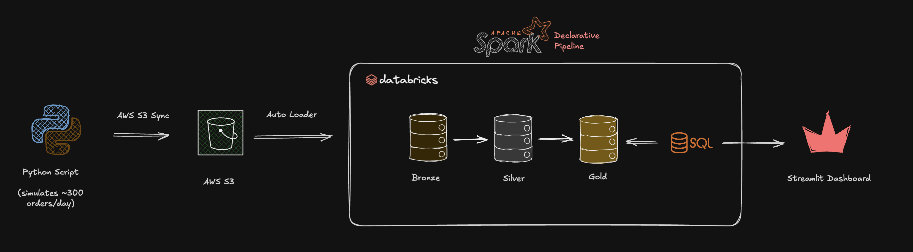

# 🍱 Food Delivery Pipeline

> End-to-end batch data pipeline for a simulated food delivery business —
> from synthetic event generation, through medallion-architecture transformations on Databricks,
> to a live ops dashboard. Built as a portfolio piece drawing on my prior experience as a
> Data Analytics Engineer at foodpanda.

🔗 **Live dashboard:** [ernestau-food-delivery-ops.streamlit.app](https://ernestau-food-delivery-ops.streamlit.app) 

📊 **Architecture:**



---

## What it does

A Python simulator pretends to be a busy food delivery service — customers place orders, vendors confirm them, drivers pick them up, deliveries complete (or get cancelled). Every hour, the simulator generates a fresh batch of events with realistic volume variation (weekend peaks, growth trend, lunch/dinner rush). Those events flow through a medallion-architecture pipeline on Databricks — raw → cleaned → modeled — and land in a Kimball-style star schema. A Streamlit dashboard queries the gold layer through Databricks SQL Warehouse, giving a live operations view.

Pipeline cadence: producer runs hourly at `:05`, Databricks pipeline runs at `:15`. New events are queryable in the dashboard within ~15 minutes of being generated.

---

## Architecture

See the diagram above, or the full [requirements and data model](system-design/v0/requirements-and-data-model.png).

---

## Tech stack

| Layer | Tools |
|---|---|
| Producer | Python 3.11, [Faker](https://faker.readthedocs.io), cron, shell |
| Storage | AWS S3 (raw JSONL), Delta Lake (bronze/silver/gold) |
| Ingestion | [Auto Loader](https://docs.databricks.com/aws/en/ingestion/cloud-files/) (`cloudFiles`) |
| Transformations | [Lakeflow Spark Declarative Pipelines](https://docs.databricks.com/aws/en/ldp/) (Python decorators: `@dp.table`, `@dp.materialized_view`) |
| Governance | Unity Catalog (3 schemas: `bronze`, `silver`, `gold`) |
| Orchestration | macOS cron (producer) + Databricks Pipelines (transformations) |
| Dashboard | Streamlit, [databricks-sql-connector](https://github.com/databricks/databricks-sql-python), Plotly |

---

## Data model

Kimball star schema in `food_delivery.gold`:

**Facts** (different grains)
- `fct_orders` — one row per order. Lifecycle timestamps denormalized as columns (`placed_at`, `confirmed_at`, ..., `delivered_at`, `cancelled_at`), measures (`gmv`, `food_cost`, `delivery_fee`, `service_fee`, `discount`), FKs, and `final_status` derived from which timestamps are filled.
- `fct_order_items` — one row per `(order, menu_item)`. Built by exploding the `items` array from the `order_placed` event.
- `fct_order_events` — one row per state transition. The slim event log; append-only source of truth for the order lifecycle.

**Dimensions** (Type 1 in v0)
- `dim_customer`, `dim_vendor`, `dim_driver`, `dim_menu_item`

**Marts**
- `fct_daily_metrics` — pre-aggregated daily KPIs (total GMV, cancellation rate, avg delivery time, etc.). Powers the dashboard.

---

## Design decisions worth highlighting

A few choices and the reasoning, since "why" is usually more interesting than "what":

| Decision | Considered | Picked | Why |
|---|---|---|---|
| **Ingestion model** | Streaming via Kafka | Batch via Auto Loader | Hourly cadence is enough for an ops dashboard — Kafka's second-level latency would be over-engineering. v1 upgrade if real-time were ever needed. |
| **Payload representation in bronze** | Raw JSON string parsed in silver | Merged struct (Auto Loader's default) | Parquet shreds nested struct fields into separate physical columns, so queries on `payload.gmv` are as fast as flat columns. Bronze stays interpretable. Would flip to raw string only for bytes-for-bytes audit fidelity. |
| **Dim semantics** | SCD2 from day one | Type 1 (overwrite) | Simulator currently doesn't mutate dims, so SCD2 would produce zero historical rows — pure complexity, no payoff. v1 enhancement when simulator adds dim mutations. |
| **Layer organization** | One pipeline per layer (bronze, silver, gold pipelines) | One pipeline across all three layers | SDP infers cross-layer dependencies automatically. Single DAG view, single cluster spinup, lower cost. |
| **Streaming vs materialized view** | All streaming | Streaming for events/silver, MV for gold facts that need GROUP BY | Streaming gives incremental processing for high-volume sources. GROUP BY pivots in gold need full recompute, which an MV does correctly. Right tool per job. |
| **Producer scheduling** | Manual runs | cron + state-file backfill | Catches up automatically when laptop wakes from sleep (up to 168h). v1 upgrade path is launchd or GitHub Actions for 24/7. |

---

## Running locally

```bash
# 1. Clone and set up venv
git clone https://github.com/ErnestAu/food-delivery-pipeline.git
cd food-delivery-pipeline
python -m venv .venv
source .venv/bin/activate
pip install -r requirements.txt

# 2. Generate sample data (single date, or a range)
python -m simulator.main --date 2024-01-15 --num-orders 300
python -m simulator.main --start-date 2024-01-15 --base-orders 100

# 3. Sync to S3 (assumes aws CLI configured + bucket exists)
aws s3 sync data/raw/ s3://<your-bucket>/data/raw/

# 4. Set up Databricks pipeline + Streamlit dashboard
# See scripts/README.md and dashboard/app.py for setup details.
streamlit run dashboard/app.py
```

A small sample of generated data is committed under [`data/samples/`](data/samples/) so the repo shows what the input looks like without needing to run the simulator.

---

## Project layout

```
food-delivery-pipeline/
├── simulator/                          # Python event generator
│   ├── config.py                       # Tunable params (volume curves, prices, cancel rates)
│   ├── models.py                       # Dataclasses for events + dims
│   ├── lifecycle.py                    # Order state machine
│   ├── dims.py                         # Dim generation (customers, vendors, drivers, menu)
│   ├── writer.py                       # Partitioned JSONL writer
│   └── main.py                         # CLI with --date / --range / --live / --hour modes
├── scripts/
│   └── live_tick.sh                    # Hourly cron driver (simulator + S3 sync + backfill)
├── databricks/
│   └── food-delivery-etl/transformations/   # SDP source files
│       ├── s3_to_bronze_dim.py         # Bronze: dims (MVs) + events (streaming table)
│       ├── silver_order_events.py      # Silver: dedupe + flatten payload
│       ├── gold_fct_orders.py          # Gold: pivot events per order_id
│       ├── gold_fct_order_items.py     # Gold: explode items array
│       ├── gold_fct_order_events.py    # Gold: slim event log
│       ├── gold_dims.py                # Gold: Type 1 dim pass-throughs
│       └── gold_fct_daily_metrics.py   # Gold: daily KPI mart
├── dashboard/
│   └── app.py                          # Streamlit dashboard
├── data/
│   └── samples/                        # Committed sample data + schema docs
├── system-design.svg                   # Architecture diagram
└── requirements.txt
```

---

## What's next (v1+)

Bookmarked enhancements, in roughly priority order:

- **On-time delivery tracking** — add a `promised_delivery_minutes` to the simulator and a derived `is_on_time` flag in gold. Unlocks "on-time rate" as the #1 ops KPI most food delivery companies track.
- **SCD2 dims** — once the simulator emits dim mutations (vendor renames, customer moves), migrate `dim_*` to SCD2 using `dp.create_auto_cdc_flow`.
- **Data quality expectations** — `@dp.expect` rules in silver/gold (`event_id IS NOT NULL`, `gmv >= 0`, etc.). Surfaces in the pipeline UI.
- **launchd over cron** — modern macOS scheduler with better TCC handling. cron has been deprecated by Apple since macOS 10.4.
- **Databricks Asset Bundles** — pipeline config + secrets + permissions as code. Promote dev → prod by switching catalogs.
- **Kafka in place of file ingestion** — replace file-based Auto Loader with a Kafka source for true real-time. Was the production target in the original design doc; deferred for v0.


